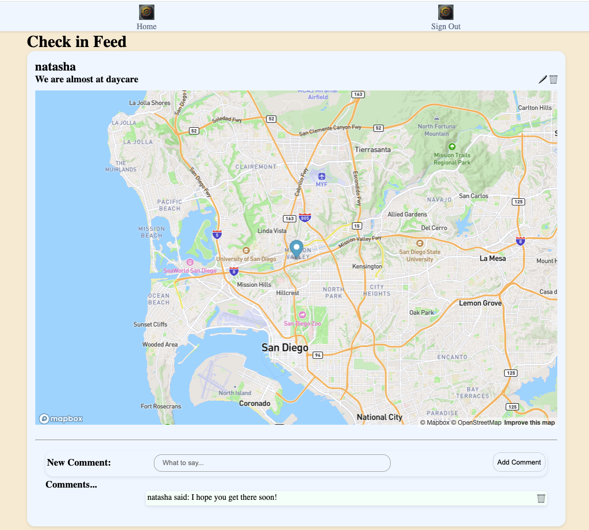
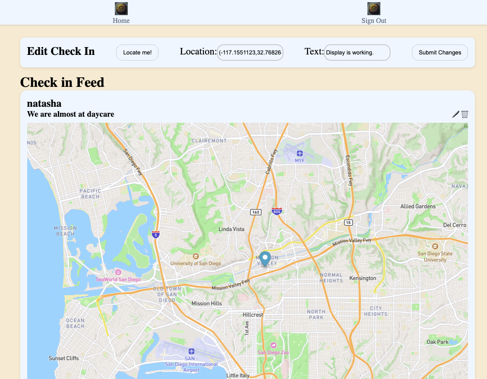
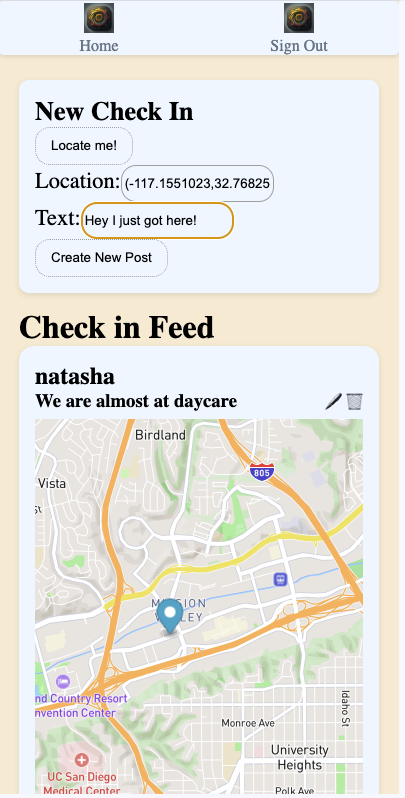
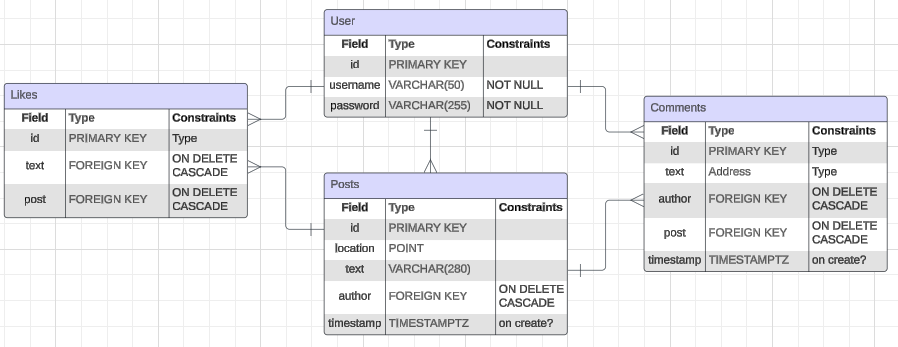
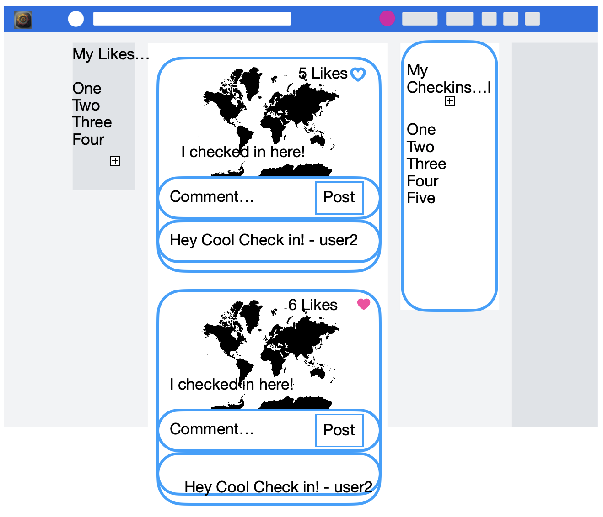

# Welcome to MoarSquare
## Screenshots

1. 
1. )
1. 

## The App
When it comes to checking in online, why stop at just four squares? With MoarSqaure you can check in, write about the location, and comment on all of your friends' checkins as well. It's a place for communitities to come together and share their locations.

Once you sign up, you can check in with your location, adding your thoughts as you do. Once you post your check-in, people can comment on it and you can see and respond to the comments as well as comment on everyone else's checkins. If you made a mistake you can always edit your checkin and delete your comments as necessary.

This app was designed for people to come together and experience the joys of sharing where they are whenever they want.

## Getting Started
If you want to dive right in you can [start here.](https://moar-square.netlify.app)
This repo lives [here](https://github.com/zbrustkern/moarsquare).

## Planning Materials
I managed my worklist on this project with [Trello](https://trello.com/b/SbXeXqZi/moarsquare).
1. 
2. Wireframe of original concept- 

## Attributions
1. [Google Gemini](https://gemini.google.com/) helped with debugging and logo generation.
2. Giang Vo helped inspire and debug the mapbox functionality.

Libraries utilized: Flask, Psycopg2, Flask-dotenv, PyJWT, Python-dotenv, Flask-CORS, Node.js, Bcrypt, React, React-DOM, React-router-dom, mapbox-gl.

## Technologies Used
This app was built with a React front-end and a Flask back-end using PostgreSQL:

### Resources Used
[Mapbox GL](https://docs.mapbox.com/api/maps/) provided the map generation and marking.

### Next Steps
1. Build out the liking functionality front end.
2. Finish comment edit functionalit to blend in seamlessly.
3. Add a search functionality
4. Ponder a way to show live posts to non-logged-in users.
5. Improve styling.